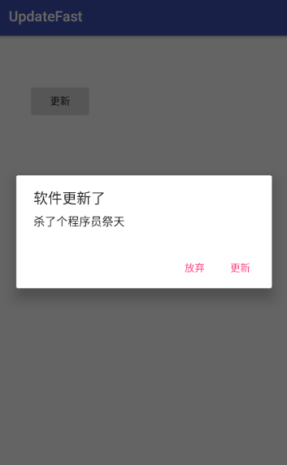
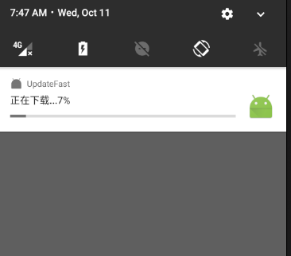

# UpdateFast
## 功能
1. 能提供快速更新功能
2. 能及时下载指定程序。

## 预览

提示更新对话框

notification提示


## 使用

```
//在需要的地方获取创建UpdateManager 对象

	private UpdateManager manager = UpdateManager.getInstance();

//首先初始化manager

	manager.init(MainActivity.this);

//在需要的地方下载

//封装好的AlertDialog

	manager.startDownloadApk(MainActivity.this,
	"软件更新了",
	"杀了个程序员祭天",
	"更新",
	"放弃",
	"http://app.mi.com/download/77791", 
	Environment.getExternalStorageDirectory()+"/AppUpdate/updatetest.apk",
	R.mipmap.ic_launcher);

//也可以直接开启下载

	manager.startDownloadApk(MainActivity.this,
	"http://app.mi.com/download/77791", 
	Environment.getExternalStorageDirectory()+"/AppUpdate/updatetest.apk",
	R.mipmap.ic_launcher);


//可在activity中加入以下代码提示用户是否获取权限。


	@PermissionSuccess(
        requestCode = 100
    )
    public void permissionSuccess() {
        Toast.makeText(this.context, "已经获取权限", 0).show();
    }

    @PermissionFail(
        requestCode = 100
    )
    public void doFailSomething() {
        Toast.makeText(this.context, "获取权限失败", 0).show();
    }

```

## 引入
### gradle
第一步 在工程的gradle下添加如下信息

```

	allprojects {
		repositories {
			...
			maven { url 'https://jitpack.io' }
		}
	}

```
	
第二步 在项目的gradle 添加如下信息

```

	dependencies {
	        compile 'com.github.Charon1997:UpdateFast:0.2'
	}


```
	
### maven

第一步

```

	<repositories>
		<repository>
		    <id>jitpack.io</id>
		    <url>https://jitpack.io</url>
		</repository>
	</repositories>

```
第二步

```

	<dependency>
	    <groupId>com.github.Charon1997</groupId>
	    <artifactId>UpdateFast</artifactId>
	    <version>0.2</version>
	</dependency>

```

我的主页：[http://chenken.top](http://chenken.top)

欢迎和大家一起交流。
